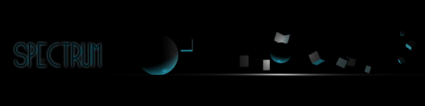

--------------

__Spectrum__ is a game about a reliance on light. Created in Unity, a player must rely on spacial awareness, memory and the occasional point lights in order to traverse the 2.5D side-scroller.

A demo version of the game can be played at __[toofifty.me/spectrum](http://toofifty.me/spectrum)__.

Please report any bugs to the [Github Issue tracker](https://github.com/Toofifty/spectrum/issues). Thanks.